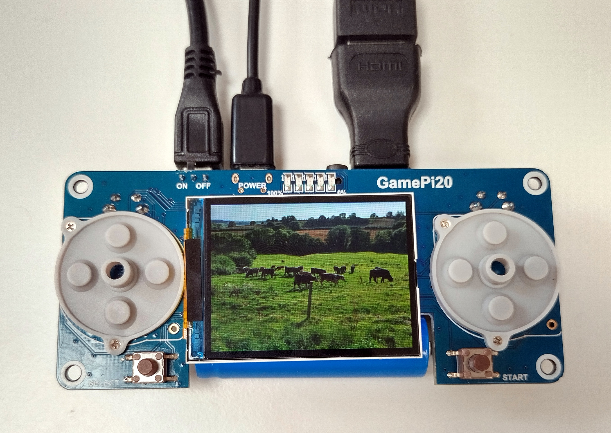

# Space Rocks GamePi20
A port of Space Rocks for GamePi20.

Changes compared to original version,
* Screen resolution reduced to 320x240 pixels.
* Number & size of "rocks" reduced for smaller screen.
* Font size for "Score", etc. reduced for smaller screen.
* Game made monochrome (not just demo mode).
* Single player only.
* Max number of bullets on screen at once reduced.
* Explosion animations reduced in complexity.

### Pi Zero Setup
The GamePi20 manufacturer provides general advice about [how to configure the drivers](https://www.waveshare.com/wiki/GamePi20) for its screen and joystick. Their guide recommends loading these modules into the OS kernel,
* flexfb
* fbtft_device

Unfortunately, these modules [are not present in current versions of Raspberry Pi OS, since kernel version 5.4](https://github.com/notro/fbtft/wiki#fbtft_device-and-flexfb-are-gone-in-54).

Therefore, I began by loading an older version of the OS onto my SD card,

* [Raspberry Pi OS with kernel version 4.19.118+](https://downloads.raspberrypi.org/raspbian/images/raspbian-2020-02-14/)

I then followed [this advice](https://www.raspberrypi.org/forums/viewtopic.php?t=281519) and ran a [script](https://github.com/johntelforduk/space-rocks-gamepi20/blob/main/gamepi20/prevent_updates.sh) to prevent the kernel being updated, removing possibility of loading the **fbtft** modules. 

Because an older version of the OS is in use, it is also necessary to update the **apt** loader before anything else can be installed.

```
sudo apt update
```
After all of that, I then followed the [Retropie instructions](https://www.waveshare.com/wiki/GamePi20) to install the GamePi20.

### Testing the PiGame20 display
```
sudo apt-get install fbi
```
Then,
```
sudo fbi -noverbose -T 1 -a -d /dev/fb1 ~/space-rocks-gamepi20/gamepi20/testovaci-obrazek.jpg

```
If all goes well, you see an image of some cows.



### Installing the game
To create and activate virtual environment,
```
python3 -m venv ~/venv/space
source ~/venv/space/bin/activate
```

```
sudo apt-get install libsdl-ttf2.0-0
sudo apt-get install libsdl-mixer1.2
sudo apt-get install python3-sdl2
```

To install the necessary game module,
```
pip install pygame
```
### Running it
To run the game,

`python game.py`

### Sound Effects
Used under creative commons license.

https://freesound.org/people/sharesynth/sounds/341235/  
https://freesound.org/people/ryansnook/sounds/110115/  
https://freesound.org/people/tommccann/sounds/235968/